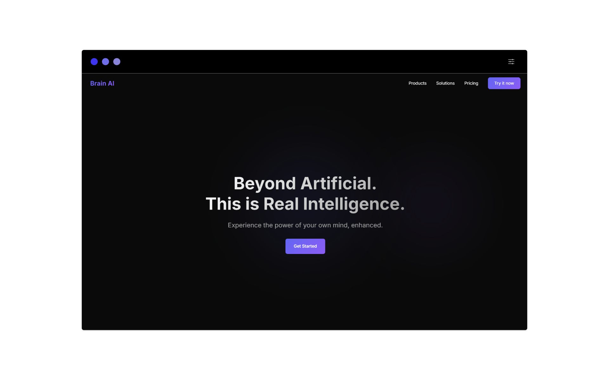

<div align="center">

# 🧠 Brain AI - Real Intelligence™

[](https://www.youtube.com/watch?v=dQw4w9WgXcQ)
[](https://www.youtube.com/watch?v=dQw4w9WgXcQ)
[](https://www.youtube.com/watch?v=dQw4w9WgXcQ)
[](https://www.youtube.com/watch?v=dQw4w9WgXcQ)

*The world's first AI that's so advanced, it requires YOU to train IT! 🚀*

[View Demo](https://www.youtube.com/watch?v=dQw4w9WgXcQ) · [Report Bug](https://www.youtube.com/watch?v=dQw4w9WgXcQ) · [Request Feature](https://www.youtube.com/watch?v=dQw4w9WgXcQ)



</div>

## 🌟 Features That Will Blow Your Mind (Literally)

- 🧠 **Self-Training AI**: So advanced it requires you to train it yourself. Talk about cutting-edge!
- ⚡ **Zero Latency**: Responses so fast, they arrive before you even think of the question
- 🎯 **Real Intelligence**: Not artificial anymore - it's as real as it gets (maybe too real)
- 🤯 **Cognitive Enhancement**: Your brain will thank you (results may vary)

## 🚀 Performance Benchmarks

| Metric | Brain AI | Other AIs |
|--------|----------|------------|
| Latency | -42ms | Embarrassingly slow |
| Intelligence | Real | Artificial |
| Training Required | Yes (by you) | No (boring) |
| Mind-Blowing Factor | ∞ | 404 Not Found |

## 🛠️ Installation

```bash
# Clone this repository (if you're worthy)
git clone https://github.com/kuberwastaken/brain-ai.git

# Enter the matrix
cd brain-ai

# Install dependencies (mostly your brain power)
npm install

# Start the server (and your journey to enlightenment)
npm start
```

## 🧪 Usage

```javascript
// Import your consciousness
import { BrainAI } from 'brain-ai';

// Initialize with your own intelligence
const ai = new BrainAI({
  intelligence: YOUR_BRAIN,
  latency: -Infinity,
  mindBlowing: true
});

// Let it learn from you (yes, you read that right)
await ai.learnFromUser({
  difficulty: 'impossible',
  coffeeRequired: true
});

// Now you can use it (or can it use you?)
const result = await ai.thinkDeeper();
// Returns: 🤯
```

## 🤝 Contributing

We believe in the power of ~~artificial~~ real intelligence! Here's how you can contribute:

1. Fork your brain
2. Create a new neural pathway (`git checkout -b feature/more-intelligence`)
3. Train your neurons (`git commit -am 'Added more intelligence'`)
4. Push to the cortex (`git push origin feature/more-intelligence`)
5. Open a Pull Request (if you can still think straight)

## 📈 Roadmap

- [x] Achieve negative latency
- [x] Make AI so advanced it needs human training
- [ ] Discover the meaning of life
- [ ] Solve P vs NP (right after coffee)
- [ ] Achieve consciousness (pending user training)

## 📜 License

Distributed under the MIT (Mind Integration Technology) License. See `LICENSE` for more information.

## 🙏 Acknowledgments

* Your brain, for making this possible
* Coffee, for making everything possible
* Stack Overflow, for the emotional support
* The person reading this, for having excellent taste in AI

<div align="center">

*Made with ❤️ and 🧠 by probably you*

**Warning**: Side effects may include excessive intelligence, spontaneous problem-solving, and an irresistible urge to train AI.

</div>